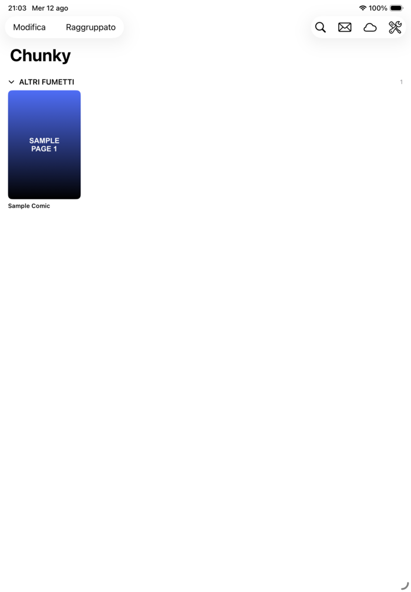
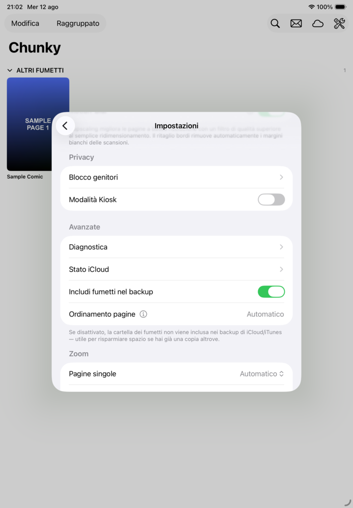

<div align="center">
  

  # Chunky

  **A fast, native comic book reader for iOS and macOS — CBZ, CBR, and PDF, with iCloud sync, remote libraries, and a reading experience tuned for long series.**

  [](#requirements)
  [](#requirements)
  [](LICENSE)

</div>

Chunky is a SwiftUI comic/manga reader built for people with large digital libraries — CBZ and CBR archives, PDFs, and loose folders of scanned images. It runs natively on both iPhone/iPad and Mac, keeps your library in sync via iCloud, and can pull comics straight from WebDAV, FTP/SFTP, OPDS servers, or your Mac's shared folders.

<div align="center">
  
  
  
</div>

## ✨ Features

### 📚 Library
- Automatic grouping by series, with favorites and read/unread progress
- iCloud Drive sync — one library across all your devices
- Import from WebDAV, FTP/SFTP, AFP, OPDS, or a local upload server reachable from any browser on the same Wi-Fi
- Turn a folder of loose scanned images into a proper comic archive
- "Rebuild library" recovery tool for restores gone half-right

### 📖 Reader
- CBZ, CBR, and PDF, with left-to-right or manga (right-to-left) reading direction
- Single or double-page spreads, automatic or manual
- Configurable page-turn feel for both tap and swipe — instant, sliding, or cross-fade
- Per-page zoom modes, including a scrollable "fit width" mode for tall pages
- One-handed mode and "hot corner" shortcuts for quick navigation without a HUD
- Auto-crop scan borders, auto tint/contrast correction, and upscaling for low-res pages
- Motion-blur while panning a zoomed page, and light/dark/sepia page themes
- Panel/region selection to share just one panel instead of a whole page

### 🔒 Privacy & control
- Face ID / Touch ID–protected parental lock, with auto-lock on background
- Kiosk mode with an idle-reset timer, built for shop-display or shared-device use
- Local-only crash diagnostics via MetricKit — nothing leaves the device

Chunky is a from-scratch SwiftUI rebuild of an earlier iOS-only app of the same name, extended with macOS support, iCloud sync, and remote library access along the way.

## 🧰 Requirements

- Xcode 15+
- iOS 14+ / macOS 11+ deployment targets
- [XcodeGen](https://github.com/yonaskolb/XcodeGen) to generate the `.xcodeproj` (not checked into the repo — see below)

## 🚀 Getting started

```bash
git clone https://github.com/Scunio/Chunky.git
cd Chunky

brew install xcodegen
xcodegen generate

open Chunky.xcodeproj
```

The project is defined in [`project.yml`](project.yml) and the `.xcodeproj` is generated from it (and gitignored), so the repo stays diff-friendly. Re-run `xcodegen generate` any time `project.yml` changes.

Once open in Xcode, pick the `Chunky_iOS` or `Chunky_macOS` scheme and run. No signing team is configured by default — set your own in Xcode's Signing & Capabilities tab before running on a device or enabling iCloud sync.

Dependencies ([ZIPFoundation](https://github.com/weichsel/ZIPFoundation) and [Unrar.swift](https://github.com/mtgto/Unrar.swift)) are resolved automatically by Swift Package Manager on first build.

## 🗂️ Project structure

```
Sources/Chunky/
├── Views/       SwiftUI screens (library, reader, settings, accounts…)
├── ViewModels/  Import/library orchestration
├── Services/    Archive readers, iCloud, remote clients, image processing…
├── Models/      Core Data model extensions
└── Resources/   Assets, Info.plist, entitlements, Core Data model
```

The reader supports CBZ/CBR/PDF via a shared `ComicPageProvider` protocol (see `Sources/Chunky/Services/ComicPageProvider.swift`), so adding a new archive format is a matter of implementing one more provider.

## 🤝 Contributing

Issues and pull requests are welcome — from bug fixes to entirely new features. If you're planning something larger than a small fix, opening an issue first to discuss the approach is appreciated but not required.

## 🙏 Acknowledgements

Chunky is built on [ZIPFoundation](https://github.com/weichsel/ZIPFoundation) and [Unrar.swift](https://github.com/mtgto/Unrar.swift) (both MIT). Full license texts are also bundled in-app under Settings → Licenze open source.

## 📄 License

MIT — see [LICENSE](LICENSE).
